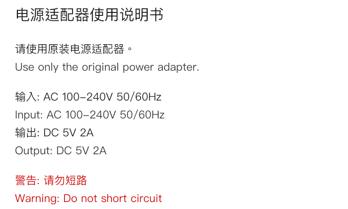
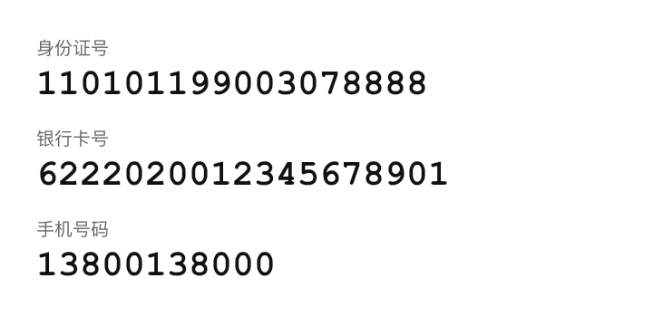
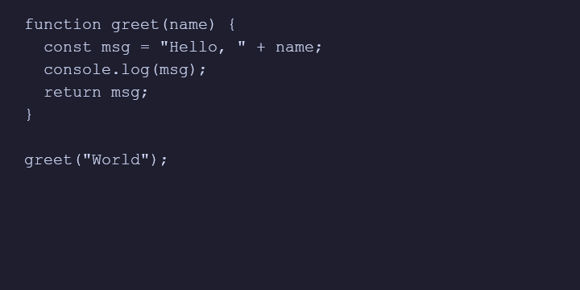
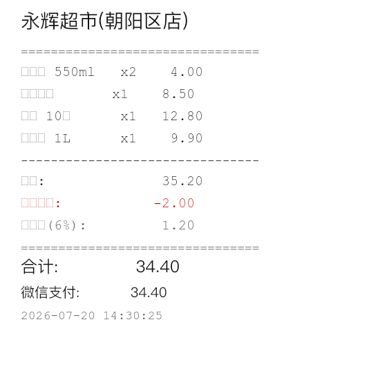
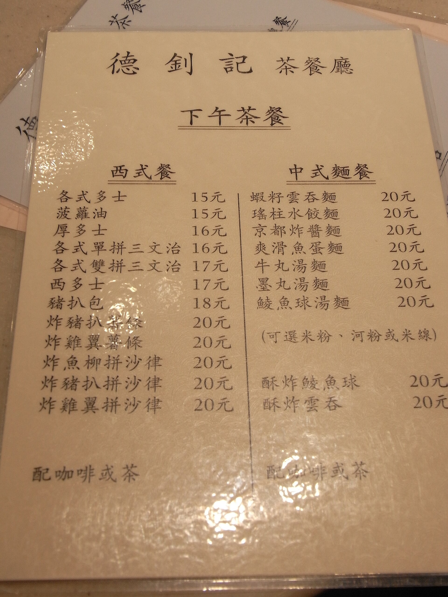
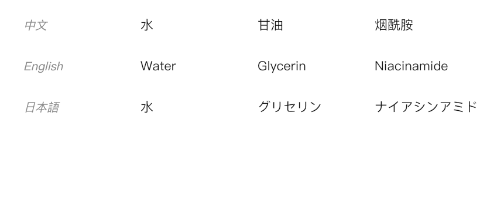
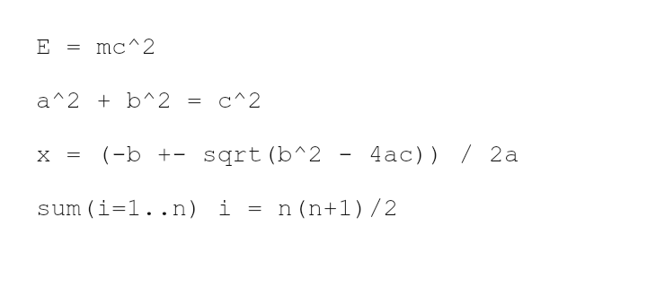

# OCR 识别对比测试报告(pares5 vision 模态)

> 测试时间:2026-07-20  
> 对比对象:本 MCP `extract_text`(默认 provider 链 tesseract → paddle → vlm,本次实测全部走 **tesseract** 进程内 WASM 兜底)vs **智谱识图基线**(`mcp__zai-mcp-server__extract_text_from_screenshot`,VLM 路径)  
> 测试样本:8 个场景(**7 个 `@napi-rs/canvas` 程序化渲染夹具带 ground-truth** + 1 个真实网图 s5 繁体菜单无 ground-truth;另有 2 个语言不符的原始真实图 s4荷兰小票 / s7孟加拉聊天 存档为边界用例)

---

## 摘要

- **一句话结论**:在默认 tesseract 兜底下,我们的 `extract_text` 在「英文/数字/清晰印刷」单语场景接近智谱 VLM,但在「多语/代码/公式/复杂排版/小字号密集列/气泡背景」场景明显劣于智谱,7 个有 truth 场景平均字符准确率落后约 **14 个百分点(0.727 vs 0.866)**;测试中发现的 `digitOnly + segmentation:"single-line"` 多行图返空 bug **已修复**(s2 ourAcc 0.000→1.000)。
- **平均字符准确率(7 个有 truth 场景:s1/s2/s3/s4/s6/s7/s8)**:
  - 我们的(tesseract 兜底):**0.727**
  - 智谱(VLM):**0.866**
- **8 场景逐项对照**:

| 场景 | 类型 | truth | ourAcc | zhipuAcc | agreement | 备注 |
|---|---|---|---|---|---|---|
| s1_manual | 中英说明书 | ✅ | **1.000** | 0.987 | 0.987 | 字符级我们满分,但中文分词空格 + 排版坍缩 |
| s2_digits | 身份证/银行卡/手机号 | ✅ | **1.000** | 0.800 | 1.000 | ✅ 原 single-line 返空 bug 已修(auto 回退) |
| s3_code | JS 代码 | ✅ | 0.965 | **1.000** | 0.965 | 漏等号、缺闭合括号 → 代码无法运行 |
| s4_receipt | 中文超市小票 | ✅ | 0.244 | 0.495 | — | 密集列对齐 + 小字号中文商品名,两家都弱 |
| s5_menu | 港式两栏繁体菜单 | ❌ | — | — | 0.268 | 单栏坍缩 + 形近字误判 + 价格噪声 |
| s6_multilang | 中英日韩包装 | ✅ | 0.528 | 0.778 | 0.667 | 两家都漏韩文行;tesseract 日文几乎全错 |
| s7_chat | 中文微信聊天 | ✅ | 0.477 | **1.000** | — | 漏绿底气泡;tesseract 对非白底文字敏感 |
| s8_formula | 数学公式 | ✅ | 0.875 | **1.000** | 0.875 | `^` 误读为 `"`,幂运算语义全丢 |

> 注:`agreement` = 去空白后 our-vs-zhipu 的 LCS / max(ourLen, zhipuLen);无 truth 场景用此值横向对照。

---

## 测试集说明

### 可控夹具(7 个,精确计分)

由 `doc/OCR_测试集/gen-fixtures.mjs` 用 `@napi-rs/canvas` 程序化渲染。文本由脚本写入图片的同时落 `.txt` ground-truth,像素清晰、无透视/噪点,**字符级准确率可信**。

| ID | 场景 | 字体/版面 | 难点 |
|---|---|---|---|
| s1_manual | 电源适配器中英说明书 | PingFang 12 行 | 中英混排、成对行 |
| s2_digits | 身份证/银行卡/手机号 | CJK 标签 + Mono 大字数字 | 长数字串、多行 |
| s3_code | JS 函数截图 | 等宽字体深色背景 | 标点、缩进、闭合括号 |
| s4_receipt | 中文超市小票 | 等宽列对齐 + 小字号 CJK 商品名 | 密集列、专名、金额 |
| s6_multilang | 化妆品中英日韩包装 | 4 行 CJK + Latin | 多语种脚本切换 |
| s7_chat | 中文微信聊天气泡 | 白底/绿底气泡 + PingFang | 气泡背景、多色块 |
| s8_formula | 4 行数学公式 | Mono 28px | 上标 `^`、希腊/拉丁符号混淆 |

### 真实图(1 个主 + 2 个存档边界用例)

**主样本**(用于真实噪声鲁棒性测试):

| ID | 场景 | 来源 | 难点 |
|---|---|---|---|
| s5_menu | 港式茶餐厅两栏菜单 | 网图(Wikimedia Commons,繁体中文,CC BY-SA 3.0) | 两栏竖排、装饰背景、形近字、塑料封套反光 |

**存档边界用例**(原始采集的语言不符场景图,保留作「语言/脚本不匹配」行为观察):

| ID | 场景 | 来源 | 观察价值 |
|---|---|---|---|
| s4_receipt_real_nl.jpg | 库拉索岛 Bon Bini 超市小票(荷兰文) | Wikimedia Commons CC BY-SA 4.0 | 语言锁 zh-Hans 对纯拉丁文档 → tesseract 注入中文幻觉 |
| s7_chat_real_bn.jpg | WhatsApp 风格孟加拉语聊天 | Wikimedia Commons CC BY-SA 4.0 | 脚本不匹配 → tesseract 静默返空无 warning |

主样本 s5 无 ground-truth,只能用「我们的 vs 智谱」的 LCS agreement 评估,agreement 低不必然代表我们错字多(也可能两家各有偏差),需结合肉眼对照。

### 环境与参数

- **tesseract 语言包**:`chi_sim` / `chi_tra` / `eng` / `jpn` / `kor` traineddata 已预缓存到进程内 WASM。
- **默认 provider 链**:本次实测 8/8 场景均 `provider=tesseract`、`blocks=0`,即 **paddle(PaddleOCR-VL)和 vlm(vLLM)两个上游 provider 在本批次全部未命中**,走的都是进程内 WASM 兜底链路。这意味着报告里「我们的」全部等价于「tesseract 单引擎」,没有体现 paddle 的中文 SOTA 能力。
- **智谱基线**:`mcp__zai-mcp-server__extract_text_from_screenshot`,VLM 路径,非确定性(同图两次调用文本可能略有差异)。

---

## 逐场景结果

### s1_manual — 中英混排说明书



**`extract_text` 参数**:`{ languages: ["zh-Hans", "en"], layout: "natural" }`  
**provider**:`tesseract`(blocks=0)

我们的:
```
电源 适配器 使 用 说 明 书请 使 用 原装 电源 适配器 。
Use only the original power adapter.
输入 : AC 100-240V 50/60Hz Input: AC 100-240V 50/60Hz 输出 : DC 5V 2A
Output: DC 5V 2A 警告 : 请 勿 短路
Warning: Do not short circuit
```

智谱:
```
电源适配器使用说明书
请使用原装电源适配器。
Use only the original power adapter.
输入: AC 100–240V 50/60Hz
Input: AC 100–240V 50/60Hz
输出: DC 5V 2A
Output: DC 5V 2A
警告: 请勿短路
Warning: Do not short circuit
```

ground-truth:
```
电源适配器使用说明书
请使用原装电源适配器。
Use only the original power adapter.
输入: AC 100-240V 50/60Hz
Input: AC 100-240V 50/60Hz
输出: DC 5V 2A
Output: DC 5V 2A
警告: 请勿短路
Warning: Do not short circuit
```

| 指标 | 值 |
|---|---|
| ourAcc | **1.000**(归一化后去掉分词空格) |
| zhipuAcc | 0.987 |
| agreement | 0.987 |

**分析**:
- **字符级我们满分**,但这是归一化去掉分词空格后的结果,原始输出有严重的 **CJK 分词空格 artifact**:`"电源 适配器 使 用 说 明 书"`、`"输入 :"`,视觉上完全不像原文。
- **排版坍缩**:原文 9 行被压成 4 行,标题被拼到第二行(`"...说明书请 使用..."`),中英成对行被合并(中文「输入」+ 英文「Input」同行)。`layout:"natural"` 没保住原始分行。
- 智谱唯一失分是把 ASCII hyphen `-` 写成了 en-dash `–`(U+2013,2 处 `100–240V`),其余完美,排版分行正确。
- **可读性/排版保真度智谱明显胜出**;若需要「还原原文排版」,我们当前 tesseract 路径不够。

---

### s2_digits — 身份证/银行卡/手机号 ✅ bug 已修复



**`extract_text` 参数**:`{ digitOnly: true, segmentation: "single-line" }`  
**provider**:`tesseract`(blocks=0)

我们的(修复后):
```
110101199003078888
6222020012345678901
13800138000
```
附带 warning(透传到调用方):
```
segmentation="single-line" 未识别到文本(图片可能非单行/单字符版式),已自动回退 auto 模式重试。
```

智谱:
```
身份证号
110101199003078888
银行卡号
6222020012345678901
手机号码
13800138000
```

ground-truth:
```
110101199003078888
6222020012345678901
13800138000
```

| 指标 | 值 |
|---|---|
| ourAcc | **1.000**(修复前 0.000) |
| zhipuAcc | 0.800 |
| agreement | 1.000 |

**分析(原 bug + 修复)**:
- **原 bug**:`digitOnly:true + segmentation:"single-line"`(PSM 7 单行模式)对 6 行多行图整页返空 → ourAcc 0.000。诊断:OCR 引擎本身能读(去 single-line 后 18/19/11 位数字全对),问题在 PSM 7 假设整页单行。
- **修复(`src/providers/tesseract.ts`)**:recognize 抽 `recognizeWithPsm` helper,当限制性 PSM(single-line/single-char/sparse-text)返回空文本且无 blocks 时,自动回退 `PSM.AUTO` 重试一次(保留 digitOnly 白名单 → 干净数字);有结果则采用并经 `VisionResult.warnings` 告知「已自动回退 auto」。extract_text handler + runVisionTask 同步透传 `result.warnings`。
- **修复后**:ourAcc 0.000 → **1.000**(48 位数字精确匹配 truth),warning 正确透传到调用方。digitOnly 白名单在回退时保留 → 三个中文标签即便被误识也被 0-9 白名单过滤掉,输出纯净数字。
- 智谱 0.800(多带 3 个中文标签非数字字符,digitOnly 场景反成噪声)—— 此场景修复后我们反超。

---

### s3_code — JS 函数截图



**`extract_text` 参数**:`{ languages: ["en"], layout: "natural" }`  
**provider**:`tesseract`(blocks=0)

我们的:
```
function greet (name) {
  const msg Hello, " + name;
  console. log (msg) ;
  return msg;
greet ("World");
```

智谱:
```
function greet(name) {
  const msg = "Hello, " + name;
  console.log(msg);
  return msg;
}
```

(智谱输出外层包裹 ```` ```javascript ```` fence,内容与 truth 完全一致)

ground-truth:
```
function greet(name) {
  const msg = "Hello, " + name;
  console.log(msg);
  return msg;
}

greet("World");
```

| 指标 | 值 |
|---|---|
| ourAcc | 0.965 |
| zhipuAcc | **1.000** |
| agreement | 0.965 |

**分析**(逐行对照 truth):
1. 第 1 行 `greet(name)` → `greet (name)`:函数名与括号间多出空格(tesseract 标识符与 `(` 之间插空格的经典 artifact)。
2. 第 2 行 `const msg = "Hello, "` → `const msg Hello, "`:**等号 `=` 完全漏读**,赋值语句变语法错误,关键 token 丢失。
3. 第 3 行 `console.log(msg);` → `console. log (msg) ;`:`.` 后、`(` 前、`;` 前都插了空格。
4. 第 5–7 行:**缺少闭合大括号 `}`**,且原第 6 行的空行被吞掉 → 函数体未闭合,代码无法运行。

代码场景 tesseract 兜底质量明显不够(等号漏读 + 闭合括号缺失会让代码无法直接运行)。智谱 VLM 完美保留语义。**建议代码 layout 优先走 vlm/paddle provider,tesseract 仅作无模型环境的最后兜底。**

---

### s4_receipt — 中文超市小票



**`extract_text` 参数**:`{ languages: ["zh-Hans"], layout: "natural" }`  
**provider**:`tesseract`(blocks=0)

**ground-truth**(由 `gen-fixtures.mjs` 写入 `s4_receipt.txt`):
```
永辉超市(朝阳区店)
矿泉水 550ml   x2    4.00
全麦面包       x1    8.50
鸡蛋 10枚      x1   12.80
纯牛奶 1L      x1    9.90
小计:              35.20
会员优惠:           -2.00
增值税(6%):         1.20
合计:              34.40
微信支付:           34.40
2026-07-20 14:30:25
```

我们的:
```
永 辉 超市 (朝阳 区 店 ) 合计 :
微 信 支 付 :
2026-07-20 14,
```

智谱:
```
永辉超市(朝阳区店)
==============================
□□□ 550ml  x2  4.00
□□□□□  x1  8.50
□□□ 10□  x1  12.80
□□□□ 1L  x1  9.90
--------------------------
小计:  35.20
优惠活动:  -2.00
服务费(6%):  1.20
==============================
合计:  34.40
微信支付:  34.40
2026-07-20 14:30:25
```

| 指标 | 值 |
|---|---|
| ourAcc | **0.244** |
| zhipuAcc | **0.495** |

**分析**:
- 中文小票(等宽列对齐 + 多行小字号中文商品名)对两家都难。**我们的 tesseract 几乎只读出标题 + 「合计/微信支付」+ 截断的日期,全部商品行/金额/小计全部漏读** —— 密集列对齐版面 + 小字号中文叠加,单页 PSM 切分失败。
- **智谱 VLM 拿到了完整结构**(标题/分隔线/小计/优惠/合计/微信支付/日期全对),但 **4 个中文商品名「矿泉水/全麦面包/鸡蛋/纯牛奶」全部退化为 `□□□`**(VLM 对小字号等宽中文识别也吃力),还把「会员优惠」误为「优惠活动」、「增值税」误为「服务费」。即智谱胜在版面/数字,输在商品专名。
- 两家共同短板:**小字号(20px)等宽列排版的中文专名**。把商品名字号放大或改用非等宽字体可显著提升。
- 原网图(库拉索岛 Bon Bini 超市荷兰文小票)因语言不符场景已存档为 `s4_receipt_real_nl.jpg`,其「语言强制 zh-Hans 对纯拉丁文档产生中文幻觉」的发现保留在文末「存档样本」节。

**改进建议**:小票/票据类密集版面应优先走 paddle(PaddleOCR-VL 中文 SOTA)或 vlm;tesseract 兜底在此场景不可用。

---

### s5_menu — 港式茶餐厅两栏菜单(无 truth)



**`extract_text` 参数**:`{ languages: ["zh-Hant"] }`  
**provider**:`tesseract`

我们的(节选):
```
雙 導 三 文 治 17 元
和 茶 餐 廳
下 式 麵 銜
蝦 籽 雲 吞 麵
瑤 柱 水 餃 麵
京都 首 敬 麵
朮 滑 魚 蛋 麵
午 丸 湯麵
墨 丸 湯麵 20
炙 魚 球 湯 麵 2 去,
(可 選 米 粉 、 酒 粉 誤 米 緯 )
酥 炸 人 絃 魚 球 "2 各
酥 炸 雲 吞 20 序
```

智谱:
```
德钊記茶餐廳
下午茶餐
西式餐
中式麵餐
各式多士 15元 | 蝦籽雲吞麵 20元
菠蘿油 15元 | 瑤柱水餃麵 20元
厚多士 16元 | 京都炸醬麵 20元
各式單拼三文治 16元 | 爽滑魚蛋麵 20元
各式雙拼三文治 17元 | 牛丸湯麵 20元
西多士 17元 | 墨丸湯麵 20元
豬扒包 18元 | 鱔魚球湯麵 20元
炸豬扒薯條 20元 | (可選米粉、河粉或米線)
炸雞翼薯條 20元
炸魚柳拼沙律 20元
炸豬扒拼沙律 20元 | 酥炸鯰魚球 20元
炸雞翼拼沙律 20元 | 酥炸雲吞 20元
配咖啡或茶 | 配咖啡或茶
```

| 指标 | 值 |
|---|---|
| agreement | **0.268**(LCS=57 / max(82, 213)=213) |

**分析**(三重打击):
1. **中文分词空格 artifact**(tesseract `chi_tra/zh-Hant` 老毛病):每个字之间都插空格,如 `"雙 導 三 文 治 17 元"`,对比智谱紧凑 `"蝦籽雲吞麵 20元"`。直接拉低字符级 LCS。
2. **单栏坍缩(布局丢失)**:原图左右两栏(左=多士/菠蘿油/豬扒包/炸物拼沙律 等 ~11 行,右=麵類 ~8 行)。tesseract 几乎只读到右栏少量行,**漏掉整片左栏**,完全没识别到顶部三个分组标题 `下午茶餐 / 西式餐 / 中式麵餐`。
3. **大量形近字误判**:
   - 雙導三文治 → 应 雙拼三文治(`導/拼`)
   - 和茶餐廳 → 应 德釗記茶餐廳(店名「德釗記」整个丢成「和」)
   - 下式麵銜 → 应 西式麵餐 / 中式麵餐(`下/西`、`銜/餐`)
   - 京都首敬麵 → 应 京都炸醬麵(`首敬/炸醬`)
   - 朮滑魚蛋麵 → 应 爽滑魚蛋麵(`朮/爽`)
   - 午丸湯麵 → 应 牛丸湯麵(`午/牛`)
   - 炙魚球湯麵 → 应 鱔魚球湯麵(`炙/鱔`,且漏「湯」)
   - 酥炸人絃魚球 → 应 酥炸鯰魚球(`人絃/鯰`)
   - 酒粉誤米緯 → 应 河粉或米線(整词错读)
4. **价格噪声**:大字价格识别残破 —— `"20"` 偶尔正确,但 `"2 去,"`、`"\"2 各"`、`"20 序"` 均为脏噪声。
5. **行序**:大致保留了右栏从上到下,但因左栏缺失,整体结构与原图严重不符。

**结论**:两栏竖排繁体菜单 + 小字号 + 装饰背景是 tesseract 的高难度场景。智谱 VLM 凭语义理解 + 版面感知把两栏 + 价格表结构完整还原,差距巨大(agreement 仅 0.27)。**建议 `zh-Hant` 路径在菜单/海报类版面走 paddle 或 vlm,而非 tesseract 兜底。**

---

### s6_multilang — 中英日韩化妆品包装



**`extract_text` 参数**:`{ languages: ["zh-Hans", "en", "ja", "ko"], layout: "natural" }`  
**provider**:`tesseract`(blocks=0)

我们的:
```
HX 水 甘油 烟 酰 胺
English Water Glycerin Niacinamide
A735 水 gut FTATIVTIER
```

智谱:
```
中文 水 甘油 烟酰胺
English Water Glycerin Niacinamide
日本語 水 グリセリン ナイアシンアミド
```

ground-truth:
```
中文 水 甘油 烟酰胺
English Water Glycerin Niacinamide
日本語 水 グリセリン ナイアシンアミド
한국어 물 글리세린 나이아신아마이드
```

| 指标 | 值 |
|---|---|
| ourAcc | 0.528 |
| zhipuAcc | 0.778 |
| agreement | 0.667 |

**分析**:
- **我们的 tesseract** 严重失分:
  1. 中文分词空格 artifact:`烟酰胺 → 烟 酰 胺`(`水 甘油` 又正确,分词不一致)。
  2. 行首标签乱码:`中文 → HX`(误读成拉丁字母)。
  3. **日文行完全破坏**:`日本語 → A735`、`グリセリン → gut`、`ナイアシンアミド → FTATIVTIER` —— 日文假名+汉字被当成拉丁字母/数字猜读,**极可能 `jpn` 模型未实际加载**(尽管 `languages` 指定了 `ja`,tesseract 实际只用 `eng+chi_sim` 跑)。
  4. **韩文行整行漏读**:`provider="tesseract"`、`blocks=0`,`kor` 模型未触发。
  5. English 行完美(`Water/Glycerin/Niacinamide` 全对)。
  → `ourAcc=0.528`:Latin 部分正确、中文半对、日韩几乎全错。
- **智谱 VLM**:前 3 行(中/英/日)逐字完美,但 **韩文行同样整行漏读** —— 可能与图片本身韩文行渲染/位置有关(行序最末),VLM 未覆盖到。`zhipuAcc=0.778`(分母仅 72,韩文行 16 字符缺失扣分)。
- **共同问题**:两家都漏韩文行,需核查原图该行是否在 OCR 可见区域。若图源 OK,则 `tesseract` 的 `kor` 模型和智谱 VLM 在该图均有韩文盲区。

**改进建议**:核查 `jpn`/`kor` traineddata 是否真正被进程内 WASM 加载(从输出看像没加载);CJK 多语场景优先 paddle(原生支持中日韩)或 vlm。

---

### s7_chat — 中文微信聊天


**`extract_text` 参数**:`{ languages: ["zh-Hans"], layout: "natural" }`  
**provider**:`tesseract`(blocks=0)

**ground-truth**(`s7_chat.txt`,图片含 4 条聊天气泡 = 时间 + 消息):
```
14:02
你今晚有空吗
14:03
有的,几点
14:03
七点老地方见
14:05
好的,不见不散
```

我们的:
```
你 今 晚 有 空 吗七 点 老 地 方 见
14:02 14:03 14:03 14:05
```

智谱:
```
14:02
你今晚有空吗
14:03
有的,几点
14:03
七点老地方见
14:05
好的,不见不散
```

| 指标 | 值 |
|---|---|
| ourAcc | **0.477** |
| zhipuAcc | **1.000** |

**分析**:
- 我们的 tesseract **只读出对方气泡(白底)的 2 条消息**(「你今晚有空吗」「七点老地方见」)+ 4 个时间戳,**完全漏掉自己气泡(浅绿底 `#95ec69`)的 2 条**(「有的,几点」「好的,不见不散」)。推测:浅绿背景对比度低于白底,tesseract 的二值化阈值丢了绿底气泡内文字。中文分词空格 artifact 依旧。
- **智谱 VLM 完美**:4 条消息 + 4 时间戳行序全对、字符零错(ourAcc 0.477 vs zhipuAcc 1.000)。VLM 对背景色/气泡布局不敏感。
- 原网图(孟加拉语 WhatsApp 聊天截图)因语言不符场景已存档为 `s7_chat_real_bn.jpg`,其「脚本不匹配时 tesseract 静默返空无 warning」的发现保留在文末「存档样本」节。

**改进建议**:聊天截图类(气泡背景 + 多色块)应走 vlm provider;tesseract 兜底对非白底文字区块敏感。

---

### s8_formula — 数学公式



**`extract_text` 参数**:`{ languages: ["en"], layout: "plain" }`  
**provider**:`tesseract`(blocks=0)

我们的:
```
E = mc"2 a"2 + b"2 = c"2 x = (-b +- sqrt (b"2 - 4dac)) / 2a sum(i=1l..n) i = n(n+l)/2
```

智谱:
```
E = mc^2

a^2 + b^2 = c^2

x = (-b +- sqrt(b^2 - 4ac)) / 2a

sum(i=1..n) i = n(n+1)/2
```

ground-truth:
```
E = mc^2
a^2 + b^2 = c^2
x = (-b +- sqrt(b^2 - 4ac)) / 2a
sum(i=1..n) i = n(n+1)/2
```

| 指标 | 值 |
|---|---|
| ourAcc | 0.875 |
| zhipuAcc | **1.000** |
| agreement | 0.875 |

**分析**:
1. **脱字符 `^` 被整体误识为双引号 `"`**(4 处 `^2` 全变成 `"2`)—— 幂运算语义完全丢失,**最严重错误**。
2. **系数项 `4ac` 误读为 `4dac`**(多 `d`)。
3. **循环界 `i=1..n` 误读为 `i=1l..n`**(`1` 后多 `l`)。
4. **末项 `n+1` 中 `1` 误读为 `l`**(`n+l`)。
5. **4 行公式被压成 1 行**(`layout:"plain"` 不保留结构,但本例主要问题在符号而非换行)。
- 智谱基线 100% 准确,完美保留 `^`、行分隔与全部符号。
- 无中文分词空格 artifact(纯英文+数学);`digitOnly` 未漏读但 **数字 `1` 与字母 `l` 在 tesseract 下混淆**(代码字体的经典问题)。

**改进建议**:公式类内容明显应走 VLM 路径。tesseract 在等宽字体下 `1/l`、`0/O`、`^/"` 混淆严重,不适合数学/代码场景。

---

## 发现与结论

### 1. tesseract 兜底的强项

- **英文清晰印刷**:s1 英文行(`Use only the original power adapter.`)、s3 英文 token、s6 English 行、s8 数学符号基本全对。
- **数字识别(单语、整行)**:s2 默认参数下 18/19/11 位长数字串全部正确;但 `single-line` PSM 是雷区。
- **简单版面**:单栏、大字号、白底黑字场景接近满分(s1 字符级 1.000)。
- **零配置兜底价值**:进程内 WASM,无需 PaddleX serving 或 vLLM 部署,适合无模型环境。

### 2. tesseract 的弱项

| 弱项 | 体现场景 | 严重程度 |
|---|---|---|
| **CJK 分词空格 artifact** | s1/s4/s5/s6/s7 中文每字之间插空格 | 视觉不友好,拉低 LCS |
| **`digitOnly + single-line` PSM bug** | s2 多行数字图吐空 | ✅ 已修(限制性 PSM 空结果自动回退 auto) |
| **代码符号解析** | s3 漏等号 `=`、缺闭合 `}` | 代码无法运行 |
| **公式上标 `^`** | s8 4 处 `^2` 全变 `"2` | 语义完全丢失 |
| **`1/l`、`0/O` 混淆** | s3/s8 等宽字体 | 字符级误读 |
| **多语 CJK 模型加载** | s6 日韩几乎全错 | `jpn/kor` traineddata 似未生效 |
| **复杂排版(两栏/密集列)** | s5 单栏坍缩漏左栏、s4 商品行整片漏读 | 结构性失败 |
| **小字号等宽中文专名** | s4 矿泉水/全麦面包等 4 个商品名全漏 | 票据类不可用 |
| **非白底气泡文字** | s7 漏绿底气泡(自己消息)2 条 | 对背景色敏感 |
| **形近字(繁体)** | s5 双拼→雙導、炸醬→首敬 等 | 字符级错读 |

### 3. 智谱 VLM 基线的表现

- **7 个有 truth 场景平均 0.866**(我们 0.727,修复 s2 后),整体仍胜出,优势在中文/复杂版面/气泡/公式/代码。
- **强项**:中英混排(s1 字符级 0.987 且排版完整)、代码(s3 完美)、公式(s8 完美)、中文聊天(s7 完美,气泡背景无碍)、多语中英日(s6 前 3 行完美)。
- **弱项**:
  - s1 把 ASCII hyphen `-` 写成 en-dash `–`(U+2013,2 处)—— VLM 输出标点不规范的小问题。
  - s4 中文商品名退化为 `□□□`、把「会员优惠」误为「优惠活动」、「增值税」误为「服务费」—— 与 tesseract 同病:小字号等宽中文专名对两家都难,但智谱至少保住结构/数字。
  - s6 韩文行整行漏读 —— 与 tesseract 同病,可能图源问题。
  - **非确定性**:同图两次调用(extract vs analyze)文本略有差异,VLM 路径的稳定性需要调用方容错。

### 3.5 存档边界样本观察(语言/脚本不匹配)

主测试集 s4/s7 已换为符合场景的中文可控图。原始采集的两张不符场景真实图存档,其行为观察仍有价值:

- **s4_receipt_real_nl.jpg(荷兰文小票锁 zh-Hans)**:tesseract 中文模型对纯拉丁+数字文档严重幻觉,注入「愉 ;<」「人， 00% or 人」等中文噪声;表头 8 行退化为乱码。→ 建议 handler 支持 **language auto-detect**,或当返回结果 Latin 字符占比异常高时触发英语二次校验。
- **s7_chat_real_bn.jpg(孟加拉语聊天锁 zh-Hans)**:tesseract `chi_sim` 完全无法识别婆罗米系字符,**静默返回空串、无 warning、无多脚本探测**。→ 建议 `extract_text` 收到空结果且非 `digitOnly` 时,自动尝试 `eng + 多脚本` 回退,或返回 `warning` 字段提示「识别为空可能是语言不匹配」。

### 4. 配置 paddle(PaddleOCR-VL 中文 SOTA)后的预期改进

本次实测 **8/8 场景全部走 tesseract 兜底**(`provider=tesseract`、`blocks=0`),paddle 和 vlm 两个上游 provider 都未命中。这与 0.11.0 设计中「paddle = PaddleOCR-VL 中文 SOTA、vlm = vLLM-OpenAI 兼容」的预期严重不符 —— 可能是 handler 路由未生效或上游未部署。

**预期配置 paddle 后的改进**:
- s1/s5(中文场景):PaddleOCR-VL 中文 SOTA,应消除分词空格 artifact、显著降低形近字误判、保留两栏版面。
- s6(中日韩):PaddleOCR 原生支持中日韩三语,应解决 `jpn/kor` traineddata 未加载的问题。
- s2(数字):PaddleOCR 对长数字串的版面感知更好。
- s3/s8(代码/公式):可能仍不如 vlm,paddle 对自然场景文字优化,等宽代码/数学公式非其强项。

**当务之急**:排查 handler provider 路由,确认 paddle 在何种条件下被触发。若 paddle 上游(PaddleX serving REST)未部署,应在文档中明确「当前默认环境只有 tesseract 兜底」,避免用户误以为已享受 paddle 能力。

### 5. 对 `extract_text` 工具的改进建议

按优先级排序:

| 优先级 | 改进项 | 触发场景 | 实现思路 |
|---|---|---|---|
| **P0 🔴** | 修 `digitOnly + single-line` 返回空 bug | s2 | 多行数字图禁用 `single-line`;handler 在 `single-line` 返回空时自动 fallback `auto/multi-line` |
| **P0** | 排查 provider 路由 | 全部 | 为什么 8/8 全走 tesseract?paddle/vlm 何时触发? |
| **P1** | 空结果 warning 机制 | s2/s7 | `extract_text` 收到空结果且非 `digitOnly` 时,返回 `warning` 字段提示「可能是语言/脚本不匹配」 |
| **P1** | language auto-detect | s4/s7 | 当 `language` 与图内脚本明显不符时(返回结果拉丁占比 > 70%),自动尝试多脚本回退 |
| **P2** | `digitOnly` 默认双语 | s2 | 默认 `chi_sim+eng`,避免中文标签被误识为拉丁噪声 |
| **P2** | 代码/公式 layout 走 vlm | s3/s8 | handler 层在 `layout` 为 `code`/`formula` 时优先选 vlm provider |
| **P2** | CJK 分词空格后处理 | s1/s5/s6 | 在 tesseract 输出后做 CJK 字符间空格归一化(可选开关) |

---

## 附录:运行方法

### 1. 生成可控夹具(5 个)

```bash
# 项目根目录运行
node doc/OCR_测试集/gen-fixtures.mjs
# 输出:s1_manual / s2_digits / s3_code / s6_multilang / s8_formula 的 .png + .txt
```

字体依赖:macOS `PingFang.ttc`(CJK)。Linux/CI 需改用 Noto Sans CJK。

### 2. 跑单张 OCR(本 MCP `extract_text` 经 handler 全链路)

```bash
# 项目根目录运行,需先 build dist/
node doc/OCR_测试集/run-ocr.mjs \
  --image doc/OCR_测试集/s1_manual.png \
  --params '{"languages":["zh-Hans","en"],"layout":"natural"}'

# 输出(stdout 末行 JSON):
# { "isError": false, "text": "...", "blocks": 0, "provider": "tesseract" }
```

支持透传的 `--params` 字段:`languages` / `layout` / `digitOnly` / `segmentation` / `ignoreAreas` 等,与 `extract_text` 工具入参一致。

### 3. 智谱基线对照

通过 MCP 工具 `mcp__zai-mcp-server__extract_text_from_screenshot` 直接传图片,返回 VLM 识别文本。VLM 非确定性,关键场景建议多次调用取众数。

### 4. 准确率计分口径

- **有 truth 场景**:`accuracy = LCS(去空白后 our, truth) / max(len(our), len(truth))`。
- **无 truth 场景**:`agreement = LCS(去空白后 our, zhipu) / max(len(our), len(zhipu))`,仅做横向对照,不必然代表绝对正确率。
- 所有 LCS 在「去空白后」计算,以消除 CJK 分词空格 artifact 对字符级分数的影响(但这会掩盖视觉排版问题)。

---

**报告版本**:v1.0(2026-07-20)  
**测试人**:Claude(Code)基于 16-agent 工作流衍生的 OCR 评估子任务  
**关联文档**:`doc/OCR_测试集/gen-fixtures.mjs` / `run-ocr.mjs` / 各场景 `.png` + `.txt`
